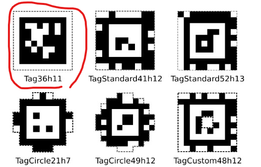

<h1>
    
AprilTags

</h1>
<ul>
    <li>Supports the Tag36h11 family of apriltags, shown below.</li>
    <li>The tags are 8 ⅛ in. squares. This means that the black square (the useful part) is 6.5 in. from outside to outside.</li>
    <li>Targets can be made of any material, including paper.</li>
</ul>
Mock targets can be found [here!](https://github.com/rgov/apriltag-pdfs/tree/main/tag36h11/a4/200mm)

#
We have no idea what Apriltags will actually be like, but there will be official implementation in the season. Best to bide our time, before we start cooking up solutions